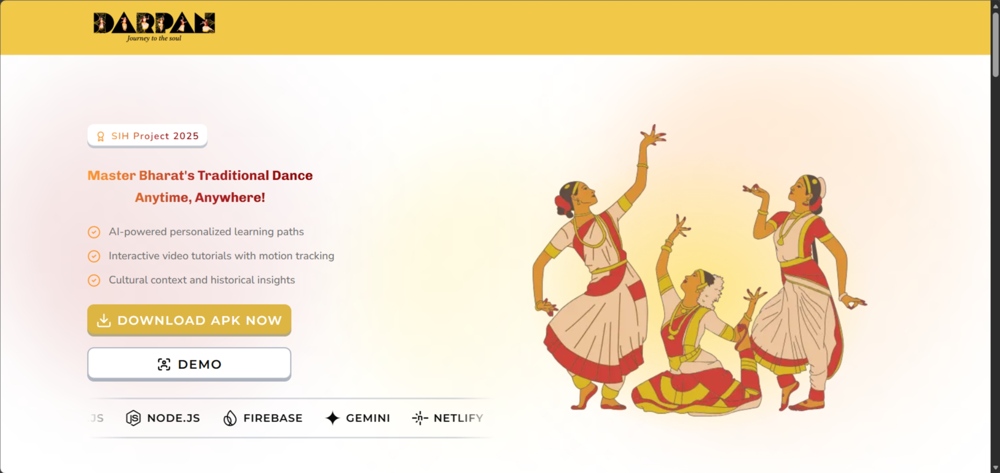

# 💃 DARPAN — AI Bharatanatyam Pose Recognition

<p align="center">
  
  
  
  
</p>

<p align="center">
  <b>AI-powered Bharatanatyam pose recognition — built for dancers, learners & creators.</b>
</p>

<p align="center">
  🌐 <a href="https://darpan-apk.vercel.app/">Live Demo</a> • 🤖 Computer Vision • 🎭 Indian Classical Dance
</p>



---

## ✨ Why Darpan?

**Darpan** brings together **Indian classical dance and modern AI**.  
Using a Roboflow-trained Bharatanatyam pose detection model, Darpan allows anyone to recognize dance poses directly from their camera — **no login, no install, fully web-based**.

This project is **public** and **anyone can use it** by plugging in their own **Roboflow API key**.

---

## 🚀 Features

- 📸 Real-time camera-based pose detection
- 🧠 Roboflow-hosted Bharatanatyam AI model
- ⚡ Built with Next.js for speed & performance
- 🌐 Runs entirely in the browser
- 🔑 Bring-your-own Roboflow API key
- 🛡️ Privacy-first (no data stored)

---

## 🧠 How It Works

1. User grants camera access
2. Video frames are sent to Roboflow inference
3. AI model detects Bharatanatyam poses
4. Results are rendered instantly on screen

> No images or videos are saved — everything stays local.

---

## 🔑 Get Your Roboflow API Key (Required)

To use or deploy Darpan yourself:

1. Visit 👉 https://roboflow.com
2. Sign up / log in
3. Go to **Dashboard → Settings → API Keys**
4. Generate a new API key
5. Copy & use it in your environment variables

---

## 🧩 Bharatanatyam Model (Roboflow)

You can:

- Use your own Bharatanatyam dataset
- Or reuse an existing trained model

Required details:

- Workspace name
- Project name
- Model version

---

## ⚙️ Environment Variables

Create a `.env.local` file:

```env
ROBOFLOW_API_KEY=
```

⚠️ `NEXT_PUBLIC_` prefix required if inference runs on the client.

---

## 🧑‍💻 Run Locally

```bash
git clone https://github.com/your-username/darpan.git
cd darpan
npm install
npm run dev
```

Visit: http://localhost:3000

---

## 🌍 Deploy Your Own

Darpan is deployed using **Vercel**.

Steps:

1. Fork the repository
2. Add environment variables in Vercel
3. Deploy 🚀

---

## 🎯 Use Cases

- Bharatanatyam students & learners
- Dance teachers & academies
- Cultural preservation projects
- AI + art experiments
- Computer vision demos

---

## 🛡️ Privacy

- ❌ No authentication
- ❌ No storage
- ✅ Camera access is local-only
- ✅ You control your API key

---

## 🙌 Credits

Built with ❤️ by **Code.itzpa1**

- GitHub: https://github.com/itzpa1
- LinkedIn: https://linkedin.com/in/itzpa1

**Tools & Platforms**

- Roboflow (Model hosting & inference)
- Next.js
- Vercel

---

## ⭐ Support the Project

If you found this project useful or inspiring:

👉 **Give this repository a ⭐ on GitHub**  
It helps the project reach more developers, dancers & creators 🚀

---

> _Blending tradition with technology — one pose at a time._ 💃🤖
